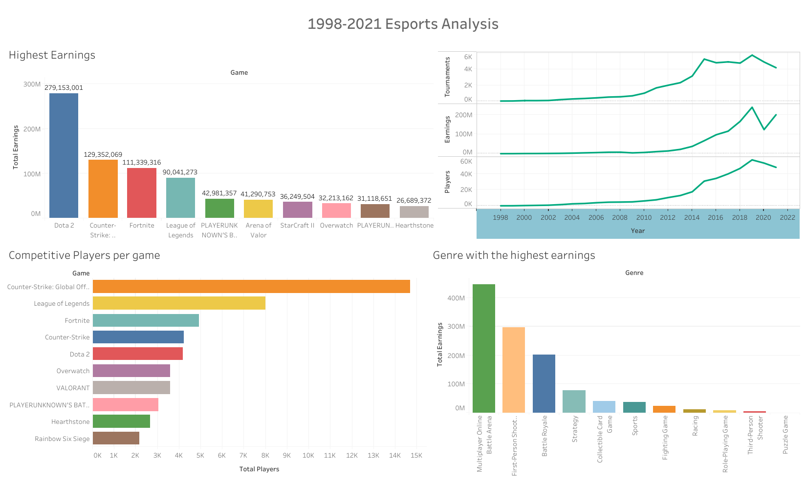
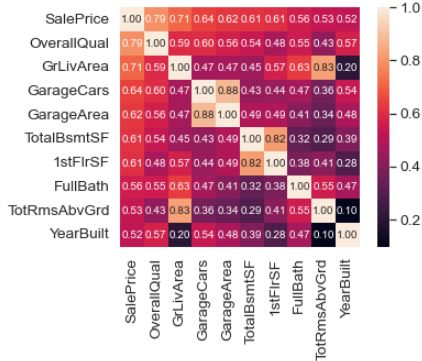
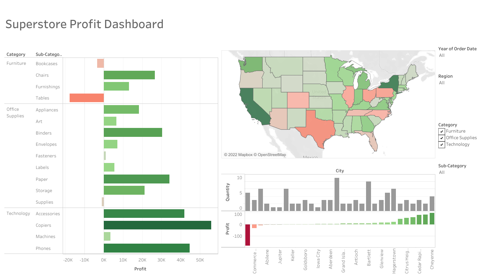
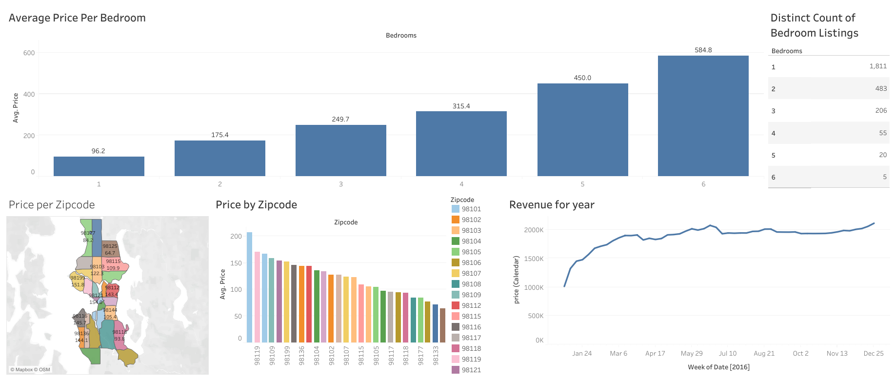

# Carlos's Porfolio

## [First Proyect: 1998-2021 Esports Analysis](https://github.com/ByCarlox/Esport-Analysis-1998-2021)

This is a proyect I made because I'm very curios about the Esports world and videogames in general.

To make this proyects I use Bigquery to summarize the data and prepared it to used directly in Tableu, I export the csv files from the querys I wrote.

The insights we can get from this datasets are:
1. The game with the highest earnings of all times is Dota 2
2. Counter Strike Global Offensive is the game with more competitive playes
3. The genre with the highest recaudation in all time is the MOBA
4. 2020 was the year with the highest earnings

## [Second Proyect: House Price Analysis in USA](https://github.com/ByCarlox/House_Data_Analysis/blob/main/House_Data_Analysis.ipynb)

Here basically I perform an Analysis using the pandas library of Python in Orden to analyze the variables that decide the price of a House in USA

Some of the conclussions I made were:

Numerical Relations

In the numerical relations we can notice that the sales prices deppends in most of the cases of the living area and the basements area

Categorical Relations

Now for the categorical variables we can apreciate that the overal quality affects directly the price of a building, and the year that a house was built not necesary decide the price in that case we have to analize the other variables to determinate the others factors

Correlation Chart 

## [Third proyect: Superstore Profit Dashboard](https://public.tableau.com/app/profile/carlos1863/viz/SuperstoreProfitDashboard_16655467540010/Dashboard1)

This is a dashboard I made while I was learning how to usea Tableau

    

## [Fourth proyect: AirBnB listings in Washingtong](https://public.tableau.com/app/profile/carlos1863/viz/AirBnBProyect/Dashboard1)

This proyect was intend to visualice how profitable would be to adquire a property in certain locations of washington to listed as an AirBnB

  
